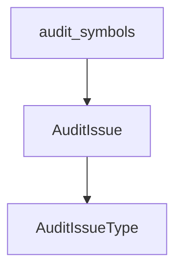

# docs/variables'n'functions/[Rust]auditor.md

## 概要
仕様書から抽出されたシンボル情報と、実際のソースコードから抽出されたAST情報を照合・監査するロジック。
不一致（型不一致、引数の数不一致、行番号ズレなど）を検出して警告情報を生成する。

## データ構造定義

### `AuditIssueType` (列挙型)
監査エラーの種類。
- `MissingInCode` - 仕様書に記載されているが、コード側に対応する定義が存在しない。
- `TypeMismatch` - 型情報が一致しない（変数の型、または関数の引数の型）。
- `ParamCountMismatch` - 引数の個数が一致しない。
- `ReturnTypeMismatch` - 関数の戻り値型が一致しない。
- `LineNumberMissing` - 仕様書に行番号が記載されていない。
- `LineNumberMismatch` - 仕様書に記載されている行番号が、実際のコード上の行番号と一致しない。

### `AuditIssue` (構造体)
監査で検出された不一致情報。
- **フィールド**:
  - `name: String` - 対象のシンボル名。
  - `issue_type: AuditIssueType` - 不一致の種類。
  - `message: String` - ユーザー向けのエラーメッセージ。
  - `spec_line: usize` - 仕様書上のエラー発生行（1-indexed）。
  - `code_line_range: Option<(usize, usize)>` - 実際のソースコード上の行範囲。
  - `expected_line_range: Option<(usize, usize)>` - 仕様書に記載されていた期待される行範囲。

## 関数定義

### `audit_symbols`
- **引数**:
  - `spec_symbols: &[SymbolInfo]` - 仕様書から抽出されたシンボルのリスト。
  - `code_symbols: &[SymbolInfo]` - コードから抽出されたシンボルのリスト。
- **戻り値**: `Vec<AuditIssue>`
- **説明**:
  - `spec_symbols` を一つずつ走査し、同じ名前を持つシンボルを `code_symbols` から探索する。
  - **名前が見つからない場合**: `MissingInCode` エラーを生成する。
  - **名前が見つかった場合**:
    - 変数/関数種別の一致を確認。
    - 仕様書に引数の型や数が明記されている場合、コード側の引数情報と突き合わせ、不一致があれば `ParamCountMismatch` や `TypeMismatch` を生成。
    - 仕様書に戻り値の型が明記されている場合、コード側と照合し `ReturnTypeMismatch` を生成。
    - 変数の型が明記されている場合、コード側と照合し `TypeMismatch` を生成。
    - 仕様書内の行番号指定 `(L10-20)` と実際のASTコード行番号範囲を比較する：
      - 未記載の場合: `LineNumberMissing` エラーを生成。
      - ズレている場合: `LineNumberMismatch` エラーを生成。

## 依存関係マッピング (Dependency Mapping)

## 影響範囲 (Impact Scope)
- 新規追加ファイルのため、既存ファイルへの影響なし。
