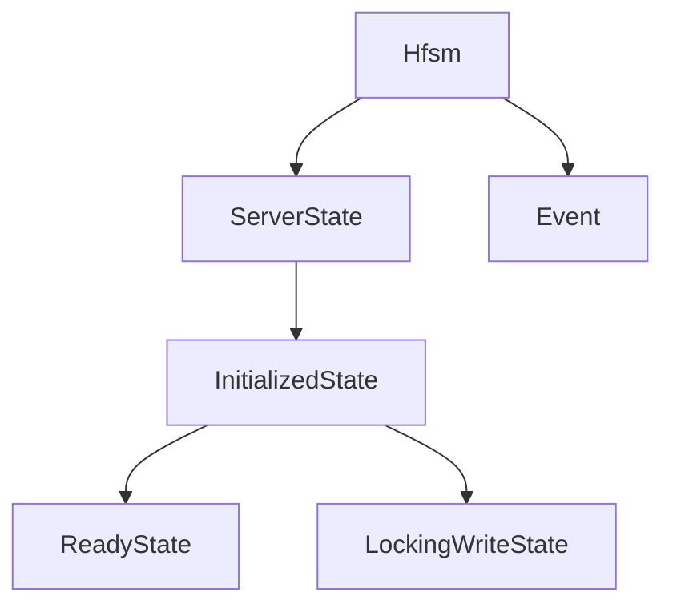

# docs/variables'n'functions/[Rust]hfsm.md

## 概要
LSPサーバーの全体状態及びドキュメント操作の排他処理を管理する階層型有限状態機械（HFSM）。
状態は親状態の中に子状態を持つ階層構造になっており、特定状態時のイベントの一括無視や安全な遷移を保証する。

## データ構造定義

### `Event` (列挙型)
状態遷移を発生させるイベント群。
- `Initialize` - LSP初期化要求
- `DocumentChanged` - ドキュメント保存や編集のイベント
- `AnalysisCompleted` - tree-sitter等による検証処理の完了
- `TriggerAutoInjection` - `autoInjection` 設定に伴う自動書き込み開始
- `LockAcquired` - ファイルの排他ロック取得成功
- `LockFailed` - ロック取得失敗（タイムアウト等）
- `WriteCompleted` - 仕様書への行番号インジェクション書き込み完了
- `WriteError` - 書き込み処理エラー
- `LockReleased` - ファイルロック解放完了
- `RecoveryCompleted` - 競合などのエラー回復処理の完了
- `Shutdown` - LSPサーバー終了要求

### `ServerState` (列挙型 - 最上位レベル)
- `Uninitialized` - 起動直後、初期化待ち状態。
- `Initialized(InitializedState)` - LSP初期化完了後のメイン動作状態。

### `InitializedState` (列挙型 - 第2レベル)
- `Ready(ReadyState)` - クライアントからの要求受付、または解析中の状態。
- `LockingWrite(LockingWriteState)` - 仕様書ファイルのロックおよびインジェクションを実行中の状態。この間、新規のドキュメント変更イベントは無視またはキュー保存される。

### `ReadyState` (列挙型 - 第3レベル)
- `DocumentIdle` - ドキュメント変更待ち。
- `Analyzing` - 構文解析・整合性監査処理を実行中。

### `LockingWriteState` (列挙型 - 第3レベル)
- `AcquiringLock` - ファイルロック取得試行中。
- `Writing` - 行番号を書き込み中。
- `ReleasingLock` - ロック解放処理中。
- `ConflictHandling` - 競合発生によるリカバリ処理中。

### `Hfsm` (構造体)
状態管理マネージャ。
- **フィールド**:
  - `state: ServerState` - 現在の状態。
- **メソッド**:
  - `new() -> Self` - 初期状態を `Uninitialized` にしてインスタンスを作成する。
  - `dispatch(&mut self, event: Event) -> void` - イベントを受信し、現在の状態階層に応じた遷移ロジックを走らせて `state` を更新する。
  - `get_state(&self) -> &ServerState` - 現在の状態への参照を返す。

## 依存関係マッピング (Dependency Mapping)

## 影響範囲 (Impact Scope)
- 新規追加ファイルのため、既存ファイルへの影響なし。
