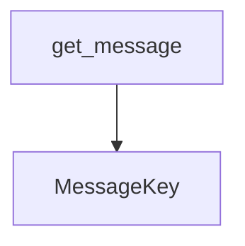

# docs/variables'n'functions/[Rust]i18n.md

## 概要
LSPサーバーが出力する警告（Diagnostics）、コードアクション（Code Action）タイトル、および整合性監査レポート（`variables_functions_audit_report.md`）の多言語対応（i18n）を管理するモジュール。
クライアントから送られてくるロケール設定に基づき、動的に警告文やレポート文を指定の言語（英語、日本語、中国語[簡体/繁体]、韓国語、エストニア語、ベトナム語、スペイン語、フランス語、ドイツ語）に翻訳して返却する。対応言語外の場合は英語（`en`）をデフォルトとして適用する。

## データ構造定義

### `MessageKey` (列挙型)
各翻訳対象メッセージを識別するためのキー。関連する値をタプルとして保持する。
- **バリアント**:
  - `MissingInCode(String)` - 仕様書にあるシンボルがコード内に見つからない場合（シンボル名）
  - `KindMismatch(String, String, String)` - シンボルの種類（変数/関数など）が不一致の場合（シンボル名, 仕様書上の種類, コード上の種類）
  - `TypeMismatch(String, String, String, String)` - 関数の引数の型が不一致の場合（関数名, 引数名, 仕様書上の型, コード上の型）
  - `VarTypeMismatch(String, String, String)` - 変数の型が不一致の場合（変数名, 仕様書上の型, コード上の型）
  - `ParamCountMismatch(String, usize, usize)` - 引数の数が不一致の場合（関数名, 仕様書の数, コードの数）
  - `ReturnTypeMismatch(String, String, String)` - 戻り値の型が不一致の場合（関数名, 仕様書の型, コードの型）
  - `LineNumberMissing(String)` - 行番号未記載（シンボル名）
  - `LineNumberMismatch(String, String, String)` - 行番号不一致（シンボル名, 仕様書の行, コードの行）
  - `ReportTitle` - 整合性監査レポートのタイトル
  - `ReportHeader` - 整合性監査レポートのヘッダーメッセージ
  - `ReportSectionTitle` - 整合性監査レポートのTODOセクションタイトル
  - `CodeActionTitle(String)` - クイックフィックスのタイトル（行番号範囲）

## 関数定義

### `get_message`
- **引数**:
  - `key: &MessageKey` - 翻訳対象のメッセージキー。
  - `locale: &str` - クライアントから受信したロケール文字列（例: `"en"`, `"ja"`, `"zh-CN"` など）。
- **戻り値**: `String`
- **説明**:
  - `locale` 文字列を大文字小文字を区別せず前方一致で判別し、適切な翻訳文字列を組み立てて返却する。
  - 判定順序：
    - `"ja"` -> 日本語
    - `"zh-cn"` / `"zh-hans"` -> 簡体字中国語
    - `"zh-tw"` / `"zh-hk"` / `"zh-hant"` -> 繁体字中国語
    - `"ko"` -> 韓国語
    - `"et"` -> エストニア語
    - `"vi"` -> ベトナム語
    - `"es"` -> スペイン語
    - `"fr"` -> フランス語
    - `"de"` -> ドイツ語
    - その他 -> 英語 (デフォルト)

## 依存関係マッピング (Dependency Mapping)

