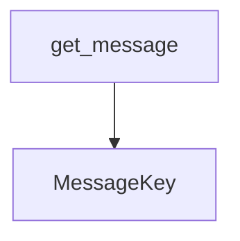

# docs/variables'n'functions/[Rust]i18n.md

## 概要
LSPサーバーが出力する警告（Diagnostics）、コードアクション（Code Action）タイトル、および整合性監査レポート（`variables_functions_audit_report.md`）の多言語対応（i18n）を管理するモジュール。
翻訳メッセージリソースは `server/locales/[言語].json` ファイル群に分離して配置される。
クライアントから送られてくるロケール設定に基づき、`OnceLock` を使用して静的インクルード（`include_str!`）した JSON 辞書から動的に警告文やレポート文を取得し、プレースホルダー（`{0}`, `{1}` 等）を置換して返却する。対応言語外の場合は英語（`en`）をデフォルトとして適用する。

## データ構造定義

### `MessageKey` (列挙型)
各翻訳対象メッセージを識別するためのキー。関連する値をタプルとして保持する。
- **バリアント**:
  - `MissingInCode(String)` - 仕様書にあるシンボルがコード内に見つからない場合（シンボル名）
  - `KindMismatch(String, String, String)` - シンボルの種類（変数/関数など）が不一致の場合（シンボル名, 仕様書上の種類, コード上の種類）
  - `TypeMismatch(String, String, String, String)` - 関数の引数の型が不一致の場合（関数名, 引数名, 仕様書上の型, コード上の型）
  - `VarTypeMismatch(String, String, String)` - 変数の型が不一致の場合（変数名, 仕様書上の型, コード上の型）
  - `ParamCountMismatch(String, usize, usize)` - 引数の数が不一致の場合（関数名, 仕様書の数, コードの数）
  - `ReturnTypeMismatch(String, String, String)` - 戻り値の型が不一致の場合（関数名, 仕様書の型, コードの型）
  - `LineNumberMissing(String)` - 行番号未記載（シンボル名）
  - `LineNumberMismatch(String, String, String)` - 行番号不一致（シンボル名, 仕様書の行, コードの行）
  - `DependencyNotUsed(String, String)` - 仕様書の依存先がコード内で使用されていない場合（関数名, 依存先名）
  - `DeadCode(String)` - 仕様書のシンボルがプロジェクト内で一度も参照されていない場合（シンボル名）
  - `ReportTitle` - 整合性監査レポートのタイトル
  - `ReportHeader` - 整合性監査レポートのヘッダーメッセージ
  - `ReportSectionTitle` - 整合性監査レポートのTODOセクションタイトル
  - `CodeActionTitle(String)` - クイックフィックスのタイトル（行番号範囲）

## 関数定義

### `get_message`
- **引数**:
  - `key: &MessageKey` - 翻訳対象のメッセージキー。
  - `locale: &str` - クライアントから受信したロケール文字列（例: `"en"`, `"ja"`, `"zh-CN"` など）。
- **戻り値**: `String`
- **説明**:
  - `locale` 文字列を大文字小文字を区別せず前方一致で判別し、適切な言語の JSON リソースファイルを決定する。
  - 判定順序：
    - `"ja"` -> `ja.json`
    - `"zh-cn"` / `"zh-hans"` -> `zh-cn.json`
    - `"zh-tw"` / `"zh-hk"` / `"zh-hant"` -> `zh-tw.json`
    - `"ko"` -> `ko.json`
    - `"et"` -> `et.json`
    - `"vi"` -> `vi.json`
    - `"es"` -> `es.json`
    - `"fr"` -> `fr.json`
    - `"de"` -> `de.json`
    - その他 -> `en.json` (デフォルト)
  - 決定した JSON 辞書から対応するメッセージのテンプレート文字列を取得し、`key` に紐づくパラメータを用いてプレースホルダー `{0}`, `{1}` 等を置換してメッセージを構築する。

## 依存関係マッピング (Dependency Mapping)

