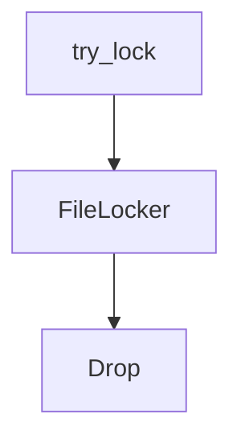

# docs/variables'n'functions/[Rust]locker.md

## 概要
自動インジェクション時のファイル書き込み競合（無限保存ループなど）を防止するため、ファイルベースの簡易的な排他ロック（スピンロック）を提供するモジュール。
アトミックなファイル作成機能を利用し、OS依存のない堅牢なロック管理を提供する。

## データ構造定義

### `FileLocker` (構造体)
ロックの状態を保持するリソース管理（RAIIパターン）オブジェクト。
- **フィールド**:
  - `lock_file_path: std::path::PathBuf` - 作成されたロックファイルのパス。

## 関数・メソッド定義

### `try_lock` (L10-36)
- **引数**:
  - `target_path: &std::path::Path` - ロックしたい対象ファイルのパス。
- **戻り値**: `Option<FileLocker>`
- **説明**:
  - 対象ファイルに対応するロックファイル（例: `target_path.with_extension("lock")`）の新規作成によるスピンロックを試みる。
  - プロセス異常終了等によるデッドロック（stale lock）を防ぐため、既存のロックファイルが存在し、かつ最終更新日時（mtime）から **10秒以上** が経過している場合は、ロックファイルを自動削除して強制解放を試みます。
  - その後、`std::fs::OpenOptions::new().write(true).create_new(true).open(...)` を使用して、アトミックにロック用ファイルを新規作成します。
  - 作成に成功した場合は `Some(FileLocker)` を返し、競合して失敗した場合は `None` を返します。

### `FileLocker` の `Drop` トレイト実装
- **説明**:
  - `FileLocker` インスタンスがスコープを抜ける際（破棄される際）に、対応するロックファイルをファイルシステムから削除（`std::fs::remove_file`）して、安全かつ確実にロックを解放する。

## 依存関係マッピング (Dependency Mapping)

## 影響範囲 (Impact Scope)
- 新規追加ファイルのため、既存ファイルへの影響なし。