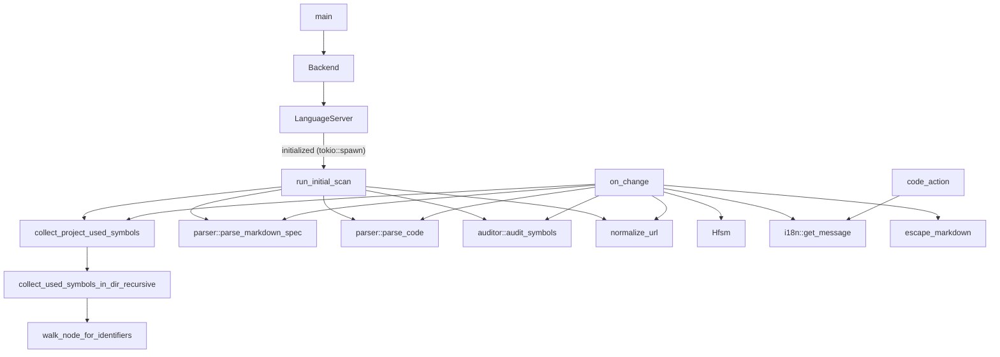

# docs/variables'n'functions/[Rust]main.md

## 概要
LSPサーバーのエントリーポイント。`tower-lsp` を使用してVS Code拡張機能（クライアント）と通信し、ドキュメントライフサイクル（オープン、編集、保存）の監視、構文解析・照合の実行、警告（Diagnostics）やクイックフィックス（Code Action）の送信を担当する。

## データ構造定義

### `Backend` (構造体)
LSPサーバーの実体。非同期タスク（`tokio::spawn`）にクローンして渡せるよう、`Clone` トレイトを自動導出（derive）する。
- **フィールド**:
  - `client: tower_lsp::Client` - クライアントとのLSP通信用オブジェクト。
  - `state: std::sync::Arc<tokio::sync::Mutex<crate::state::hfsm::Hfsm>>` - サーバー状態をスレッド安全に管理するHFSMインスタンス。
  - `root_path: Arc<Mutex<Option<PathBuf>>>` - ワークスペースルートパス。
  - `locale: Arc<Mutex<String>>` - クライアントの言語ロケール設定。
  - `issues_cache: Arc<Mutex<std::collections::HashMap<url::Url, Vec<crate::auditor::AuditIssue>>>>` - 各ファイルごとの最新監査エラー結果を保持するキャッシュ。
  - `project_used_symbols: Arc<Mutex<Option<std::collections::HashSet<String>>>>` - プロジェクト全体で使用されている識別子のキャッシュ用フィールド。重いファイルスキャンの多発を防ぐ。

## 関数定義

### `main` (L1018-1037)
- **引数**: なし
- **戻り値**: `tokio::io::Result<()>` (非同期)
- **説明**:
  - `tokio` 非同期メイン関数。
  - 標準入力および標準出力を介して `tower-lsp` サーバーをセットアップし、起動する。

### `on_change` (L176-576)
- **引数**:
  - `backend: &Backend` - バックエンドインスタンス。
  - `uri: tower_lsp::lsp_types::Url` - 変更があったドキュメントのURI。
  - `text: String` - ドキュメントのテキスト全文。
  - `force_update_cache: bool` - プロジェクト全体のスキャンキャッシュを強制更新するかどうかのフラグ。
- **戻り値**: `void` (非同期)
- **説明**:
  - ドキュメント変更時（`did_open`, `did_change`, `did_save`）に呼び出される非同期ヘルパー。
  - HFSMの状態を `DocumentChanged` に遷移させる。
  - 対象ファイルが仕様書かコードかを判別し、対になるファイルと言語を特定する。
  - 仕様書ファイル名から言語・シンボル名を抽出する際、`.md` 拡張子で終わっており、十分な長さ（`end_bracket + 4` 以上）があるかを検証するDoS対策ガードを適用した上でスライスを行います。
  - 整合性照合のため、仕様書側は `parser::parse_markdown_spec` でパースし、コード側は `parser::parse_code(&code_text, &lang)` を用いて対象言語のAST解析を実行する。
  - プロジェクト全体のシンボル収集には、`force_update_cache` が `true` の場合、あるいはキャッシュが空の場合のみ `collect_project_used_symbols` で再スキャンを行います。さらに、`force_update_cache` が `true` の場合は、プロジェクト内のすべての仕様書ファイルを再スキャン・再監査し、全体の診断結果と `issues_cache`、監査レポートを最新の状態に更新します。それ以外（通常のキー入力による `did_change` 時）は高速化のためキャッシュされた値を使用し、変更されたファイル単体のみを監査します。
  - 照合結果からエラーがあれば、`locale` 情報に応じた `i18n` 翻訳メッセージを作成し、クライアントに対して `publish_diagnostics` を発行してエラー波線を表示する。
  - 同様に `variables_functions_audit_report.md` をロケールに合わせて生成/削除する。レポート出力時のシンボル名等は `escape_markdown` でエスケープします。
  - 処理完了後、HFSMを `AnalysisCompleted` に遷移させる。

### `run_initial_scan` (L578-877)
- **引数**:
  - `backend: &Backend`
- **戻り値**: `void` (非同期)
- **説明**:
  - LSPサーバー起動時に、ワークスペース全体の変数関数仕様書（`docs/variables'n'functions` 配下の `[Language]filename.md`）を一括スキャンして初期解析を行う。
  - 起動時のフリーズを防ぐため、`LanguageServer::initialized` 内で `tokio::spawn` を介して非同期スレッドで呼び出される。
  - パフォーマンス向上のため、プロジェクト全体のシンボル出現情報を収集する重い再帰走査 `collect_project_used_symbols` は、ループに入る前に1回だけ実行し、収集した結果をループ内の各仕様書の解析に再利用する。
  - 解析結果は `publish_diagnostics` を介してクライアントに通知され、また一括で `variables_functions_audit_report.md` に出力される。

### `run_scan`
- **引数**:
  - `backend: &Backend`
- **戻り値**: `void` (非同期)
- **説明**:
  - `run_initial_scan` の実際のスキャン処理を担うヘルパー関数。
  - `force_update_cache` が `true` になった時、あるいは初期起動時に呼び出され、プロジェクト内のすべての仕様書ファイルを読み込み、対応するコードファイルと照合して診断結果を送信する。
  - 監査結果に基づいて `variables_functions_audit_report.md` を新規作成または削除する。

### `LanguageServer` トレイト実装
`Backend` に対して `tower_lsp::LanguageServer` を実装する。
- **`initialize`**: HFSMに `Initialize` をディスパッチし、`initialization_options` からロケール設定（`locale`）を読み取って保持するとともに、サーバーの対応能力（LSP Capabilities: SyncKind::Full, CodeActionProviderなど）をクライアントに応答する。
- **`initialized`**: LSPサーバー初期化完了時に呼び出される。`self.clone()` を作成し、`tokio::spawn` を使って初期一括スキャン（`run_initial_scan`）を非同期にバックグラウンドで開始する。
- **`shutdown`**: HFSMに `Shutdown` をディスパッチして終了準備を行う。
- **`did_open` / `did_change` / `did_save`**: 変更されたドキュメントのテキストを取得し、`on_change` を呼び出して監査を実行する。`did_change` では `force_update_cache` を `false` にし、それ以外では `true` にしてスキャン頻度を抑制する。
- **`code_action`**: 整合性エラー（特に行番号不足やミスマッチ）のある箇所に対し、行番号を自動挿入する Code Action（WorkspaceEditによるテキスト変更）を生成してクライアントに提供する。その際、すでに見出し行の末尾に行番号 `(Lold-old)` が存在している場合は、それを新しい行番号で置換（Replace）し、重複書き込みを防ぎます。

### `collect_project_used_symbols` (L917-921)
- **引数**:
  - `dir: &Path` - プロジェクトルートなどの走査開始ディレクトリ。
- **戻り値**: `std::collections::HashSet<String>` (非同期)
- **説明**:
  - プロジェクト内のソースファイルから使用されているすべての識別子を収集する。
  - `collect_used_symbols_in_dir_recursive` を呼び出す。

### `collect_used_symbols_in_dir_recursive` (L923-962)
- **引数**:
  - `dir: &Path` - 走査対象ディレクトリ。
  - `used_set: &mut std::collections::HashSet<String>` - 収集した識別子を格納するセット。
- **戻り値**: `void` (非同期)
- **説明**:
  - `target`, `node_modules`, `docs`, `.git` ディレクトリを除外して再帰的に走査する。
  - 拡張子が `rs`, `ts`, `js`, `py`, `go`, `c`, `h`, `cpp`, `hpp`, `cc`, `cxx`, `cs`, `rb`, `swift`, `kt`, `kts`, `java` のファイルを処理する。
  - `rs` ファイルは tree-sitter Rust parser で構文解析し、`walk_node_for_identifiers` を呼び出す（他の言語も必要に応じてパーサーによる厳密な抽出を行うか、正規表現で簡易的に識別子を取り出す）。

### `walk_node_for_identifiers` (L964-1004)
- **引数**:
  - `node: tree_sitter::Node` - 現在の構文ノード。
  - `source: &str` - ソースコード文字列.
  - `used_set: &mut std::collections::HashSet<String>` - 使用識別子セット。
- **戻り値**: `void`
- **説明**:
  - `identifier` や `type_identifier` 等の識別子ノードを抽出し、`used_set` に追加する。
  - ただし、関数定義や構造体定義そのものの定義名（親ノードの `name` フィールドに紐づくノード）は、自分自身の定義による使用中誤検知を防ぐため、除外する。
  - 再帰的に子ノードを探索する。

### `normalize_url` (L880-890)
- **引数**:
  - `url: &url::Url` - 正規化対象のURL。
- **戻り値**: `url::Url`
- **説明**:
  - Windows環境におけるドライブレターの大文字小文字の揺れ（`C:` と `c:`）を標準化するため、ドライブレターのみを小文字に変換したURLを返す。
  - URLエンコードされた文字（`[` や `]` などが `%5B`, `%5D` になっているもの）を破壊しないよう、`to_file_path` や `from_file_path` は使用せず、文字列ベースの置換処理で安全に正規化を行う。

### `escape_markdown` (L1006-1015)
- **引数**:
  - `text: &str` - エスケープ対象の文字列。
- **戻り値**: `String`
- **説明**:
  - Markdown レポートファイルを生成する際、不一致箇所やシンボル名に含まれる特殊文字（`*`, `_`, `` ` ``, `[`, `]` など）をエスケープして、レポートドキュメントの構造が破壊されるのを防ぐヘルパー。

## 依存関係マッピング (Dependency Mapping)

## 影響範囲 (Impact Scope)
- `main.rs` の hello world 実装からの大幅な書き換え。モジュール全体の起動基盤となる。
- デッドコード（未使用コード）を検出するため、プロジェクト全体のファイルIOとtree-sitterパースが追加される。