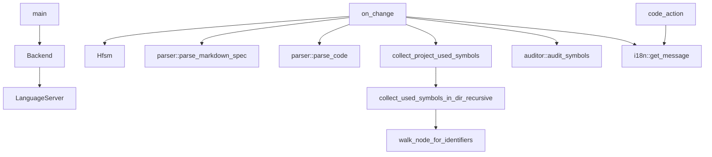

# docs/variables'n'functions/[Rust]main.md

## 概要
LSPサーバーのエントリーポイント。`tower-lsp` を使用してVS Code拡張機能（クライアント）と通信し、ドキュメントライフサイクル（オープン、編集、保存）の監視、構文解析・照合の実行、警告（Diagnostics）やクイックフィックス（Code Action）の送信を担当する。

## データ構造定義

### `Backend` (構造体)
LSPサーバーの実体。
- **フィールド**:
  - `client: tower_lsp::Client` - クライアントとのLSP通信用オブジェクト。
  - `state: std::sync::Arc<tokio::sync::Mutex<crate::state::hfsm::Hfsm>>` - サーバー状態をスレッド安全に管理するHFSMインスタンス。
  - `root_path: Arc<Mutex<Option<PathBuf>>>` - ワークスペースルートパス。
  - `locale: Arc<Mutex<String>>` - クライアントの言語ロケール設定。
  - `issues_cache: Arc<Mutex<std::collections::HashMap<url::Url, Vec<crate::auditor::AuditIssue>>>>` - 各ファイルごとの最新監査エラー結果を保持するキャッシュ。Windows環境のドライブレター大文字小文字の違いによる二重登録を防ぐため、キーのUrlはドライブレター部分を小文字に正規化して使用する。

## 関数定義

### `main`
- **引数**: なし
- **戻り値**: `tokio::io::Result<()>` (非同期)
- **説明**:
  - `tokio` 非同期メイン関数。
  - 標準入力および標準出力を介して `tower-lsp` サーバーをセットアップし、起動する。

### `on_change`
- **引数**:
  - `backend: &Backend` - バックエンドインスタンス。
  - `uri: tower_lsp::lsp_types::Url` - 変更があったドキュメントのURI。
  - `text: String` - ドキュメントのテキスト全文。
- **戻り値**: `void` (非同期)
- **説明**:
  - ドキュメント変更時（`did_open`, `did_change`, `did_save`）に呼び出される非同期ヘルパー。
  - HFSMの状態を `DocumentChanged` に遷移させる。
  - 対象ファイルが仕様書かコードかを判別し、対になるファイルと言語（"rust", "typescript", "python", "go", "c", "cpp", "csharp", "ruby", "swift", "kotlin" など）を特定する。
  - 整合性照合のため、仕様書側は `parser::parse_markdown_spec` でパースし、コード側は `parser::parse_code(&code_text, &lang)` を用いて対象言語のAST解析を実行する。
  - 照合結果からエラーがあれば、`locale` 情報に応じた `i18n` 翻訳メッセージを作成し、クライアントに対して `publish_diagnostics` を発行してエラー波線を表示する。
  - 同様に `variables_functions_audit_report.md` をロケールに合わせて生成/削除する。
  - 処理完了後、HFSMを `AnalysisCompleted` に遷移させる。

### `LanguageServer` トレイト実装
`Backend` に対して `tower_lsp::LanguageServer` を実装する。
- **`initialize`**: HFSMに `Initialize` をディスパッチし、`initialization_options` からロケール設定（`locale`）を読み取って保持するとともに、サーバーの対応能力（LSP Capabilities: SyncKind::Full, CodeActionProviderなど）をクライアントに応答する。
- **`shutdown`**: HFSMに `Shutdown` をディスパッチして終了準備を行う。
- **`did_open` / `did_change` / `did_save`**: 変更されたドキュメントのテキストを取得し、`on_change` を呼び出して監査を実行する。
- **`code_action`**: 整合性エラー（特に行番号不足やミスマッチ）のある箇所に対し、行番号を自動挿入する Code Action（WorkspaceEditによるテキスト変更）を生成してクライアントに提供する。

### `collect_project_used_symbols`
- **引数**:
  - `dir: &Path` - プロジェクトルートなどの走査開始ディレクトリ。
- **戻り値**: `std::collections::HashSet<String>` (非同期)
- **説明**:
  - プロジェクト内のソースファイルから使用されているすべての識別子を収集する。
  - `collect_used_symbols_in_dir_recursive` を呼び出す。

### `collect_used_symbols_in_dir_recursive`
- **引数**:
  - `dir: &Path` - 走査対象ディレクトリ。
  - `used_set: &mut std::collections::HashSet<String>` - 収集した識別子を格納するセット。
- **戻り値**: `void` (非同期)
- **説明**:
  - `target`, `node_modules`, `docs`, `.git` ディレクトリを除外して再帰的に走査する。
  - 拡張子が `rs`, `ts`, `js`, `py`, `go`, `c`, `h`, `cpp`, `hpp`, `cc`, `cxx`, `cs`, `rb`, `swift`, `kt`, `kts` のファイルを処理する。
  - `rs` ファイルは tree-sitter Rust parser で構文解析し、`walk_node_for_identifiers` を呼び出す（他の言語も必要に応じてパーサーによる厳密な抽出を行うか、正規表現で簡易的に識別子を取り出す）。

### `walk_node_for_identifiers`
- **引数**:
  - `node: tree_sitter::Node` - 現在の構文ノード。
  - `source: &str` - ソースコード文字列。
  - `used_set: &mut std::collections::HashSet<String>` - 使用識別子セット。
- **戻り値**: `void`
- **説明**:
  - `identifier` や `type_identifier` 等の識別子ノードを抽出し、`used_set` に追加する。
  - ただし、関数定義や構造体定義そのものの定義名（親ノードの `name` フィールドに紐づくノード）は、自分自身の定義による使用中誤検知を防ぐため、除外する。
  - 再帰的に子ノードを探索する。

## 依存関係マッピング (Dependency Mapping)

## 影響範囲 (Impact Scope)
- `main.rs` の hello world 実装からの大幅な書き換え。モジュール全体の起動基盤となる。
- デッドコード（未使用コード）を検出するため、プロジェクト全体のファイルIOとtree-sitterパースが追加される。

