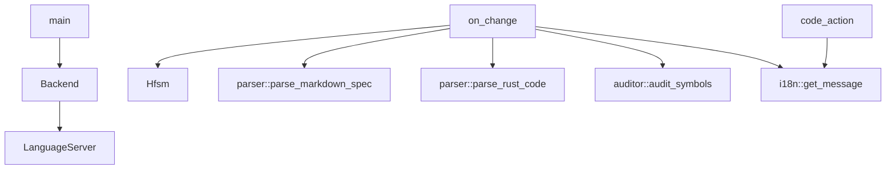

# docs/variables'n'functions/[Rust]main.md

## 概要
LSPサーバーのエントリーポイント。`tower-lsp` を使用してVS Code拡張機能（クライアント）と通信し、ドキュメントライフサイクル（オープン、編集、保存）の監視、構文解析・照合の実行、警告（Diagnostics）やクイックフィックス（Code Action）の送信を担当する。

## データ構造定義

### `Backend` (構造体)
LSPサーバーの実体。
- **フィールド**:
  - `client: tower_lsp::Client` - クライアントとのLSP通信用オブジェクト。
  - `state: std::sync::Arc<tokio::sync::Mutex<crate::state::hfsm::Hfsm>>` - サーバー状態をスレッド安全に管理するHFSMインスタンス。
  - `root_path: Arc<Mutex<Option<PathBuf>>>` - ワークスペースルートパス。
  - `locale: Arc<Mutex<String>>` - クライアントの言語ロケール設定。

## 関数定義

### `main`
- **引数**: なし
- **戻り値**: `tokio::io::Result<()>` (非同期)
- **説明**:
  - `tokio` 非同期メイン関数。
  - 標準入力および標準出力を介して `tower-lsp` サーバーをセットアップし、起動する。

### `on_change`
- **引数**:
  - `backend: &Backend` - バックエンドインスタンス。
  - `uri: tower_lsp::lsp_types::Url` - 変更があったドキュメントのURI。
  - `text: String` - ドキュメントのテキスト全文。
- **戻り値**: `void` (非同期)
- **説明**:
  - ドキュメント変更時（`did_open`, `did_change`, `did_save`）に呼び出される非同期ヘルパー。
  - HFSMの状態を `DocumentChanged` に遷移させ、対象ファイルの構文解析および整合性照合（`auditor::audit_symbols`）を行う。
  - 照合結果からエラーがあれば、`locale` 情報に応じた `i18n` 翻訳メッセージを作成し、クライアントに対して `publish_diagnostics` を発行してエラー波線を表示する。
  - 同様に `variables_functions_audit_report.md` をロケールに合わせて生成/削除する。
  - 処理完了後、HFSMを `AnalysisCompleted` に遷移させる。

### `LanguageServer` トレイト実装
`Backend` に対して `tower_lsp::LanguageServer` を実装する。
- **`initialize`**: HFSMに `Initialize` をディスパッチし、`initialization_options` からロケール設定（`locale`）を読み取って保持するとともに、サーバーの対応能力（LSP Capabilities: SyncKind::Full, CodeActionProviderなど）をクライアントに応答する。
- **`shutdown`**: HFSMに `Shutdown` をディスパッチして終了準備を行う。
- **`did_open` / `did_change` / `did_save`**: 変更されたドキュメントのテキストを取得し、`on_change` を呼び出して監査を実行する。
- **`code_action`**: 整合性エラー（特に行番号不足やミスマッチ）のある箇所に対し、行番号を自動挿入する Code Action（WorkspaceEditによるテキスト変更）を生成してクライアントに提供する。

## 依存関係マッピング (Dependency Mapping)

## 影響範囲 (Impact Scope)
- `main.rs` の hello world 実装からの大幅な書き換え。モジュール全体の起動基盤となる。
