# docs/variables'n'functions/[Rust]parser.md

## 概要
Markdown仕様書およびRustソースコードから、変数や関数の宣言情報を抽出する構文解析モジュール。
仕様書のテキスト解析には `pulldown-cmark` を、Rustコードの構造解析には `tree-sitter` を使用する。

## データ構造定義

### `SymbolKind` (列挙型)
シンボルの種類。
- `Variable` - 変数
- `Function` - 関数

### `SymbolInfo` (構造体)
仕様書またはソースコードから抽出された宣言情報。
- **フィールド**:
  - `name: String` - 変数名または関数名。
  - `kind: SymbolKind` - シンボルの種類（変数か関数か）。
  - `params: Option<Vec<(String, String)>>` - 引数のリスト（名前と型）。関数の場合のみ有効。
  - `return_type: Option<String>` - 戻り値の型。関数の場合のみ有効.
  - `var_type: Option<String>` - 変数の型。変数の場合のみ有効.
  - `line_range: Option<(usize, usize)>` - 仕様書に記載されている、あるいはASTから検出した行範囲（開始行, 終了行）。
  - `spec_line: Option<usize>` - 仕様書内での定義が記述されている物理行番号（1-indexed）。仕様書から抽出された場合のみ有効。
  - `dependencies: Option<Vec<String>>` - 仕様書内のMermaid図等から抽出した依存先シンボル名リスト。
  - `used_symbols: Option<Vec<String>>` - コード側のAST等から抽出した使用されている識別子リスト。

## 関数定義

### `parse_markdown_spec` (L528-605)
- **引数**:
  - `content: &str` - 仕様書Markdownのテキスト内容。
- **戻り値**: `Vec<SymbolInfo>`
- **説明**:
  - Markdownのテキストを解析し、3段目以上のレベル（`###`や`####`など）の見出しを抽出する。
  - 見出し記号とバッククォートで囲まれたシンボル名の間にある任意の文字列（例：`### 関数: `try_lock`` の ` 関数: `）を無視してパースを行う。
  - 各見出し行の物理行番号（1-indexed）を `spec_line` にマッピングする。
  - 正規表現を用いて、バッククォート内のシンボル名および行番号記述 `(L10-20)` をパースして `SymbolInfo` を生成する。型情報は `None` とする。

### `parse_rust_code` (L607-617)
- **引数**:
  - `code: &str` - Rustソースコードのテキスト内容。
- **戻り値**: `Vec<SymbolInfo>`
- **説明**:
  - tree-sitterパーサーを使用してRustコードをASTに変換する。
  - ASTを巡回（Walk）し、関数定義（`function_item`）、定数（`const_item`）、静的変数（`static_item`）などのシンボル名・シグネチャを抽出する。
  - ASTノードのメタデータから、コード上の開始行および終了行（1-indexed）を取得し、`SymbolInfo` を生成する。

### `parse_code` (L23-38)
- **引数**:
  - `code: &str` - ソースコードのテキスト内容。
  - `lang: &str` - 対象の言語（"rust", "typescript", "javascript", "python", "go", "c", "cpp", "csharp", "ruby", "swift", "kotlin" など）。
- **戻り値**: `Vec<SymbolInfo>`
- **説明**:
  - 引数 `lang` の種類に基づいて、それぞれの言語用パース関数を呼び分け、抽出されたシンボルリストを返します。対応していない言語の場合は空のリストを返します。

### `parse_typescript_code` (L40-50)
- **引数**:
  - `code: &str` - TypeScript/JavaScriptソースコードのテキスト内容。
- **戻り値**: `Vec<SymbolInfo>`
- **説明**:
  - `tree-sitter-typescript` を用いてコードをパースします。
  - `function_declaration` や `method_definition` などの関数定義、および `variable_declarator` などの変数定義からシンボル情報（引数名、引数の型、戻り値の型、変数の型など）を抽出して `SymbolInfo` を返します。

### `parse_python_code` (L168-178)
- **引数**:
  - `code: &str` - Pythonソースコードのテキスト内容.
- **戻り値**: `Vec<SymbolInfo>`
- **説明**:
  - `tree-sitter-python` を用いてコードをパースします。
  - `function_definition` などの関数定義、および `assignment` の左辺（`typed_parameter` 等の型ヒントも含む）から変数・関数シンボル情報を抽出して `SymbolInfo` を返します。

### `parse_go_code` (L317-327)
- **引数**:
  - `code: &str` - Goソースコードのテキスト内容。
- **戻り値**: `Vec<SymbolInfo>`
- **説明**:
  - `tree-sitter-go` を用いてコードをパースします。
  - `function_declaration` や `method_declaration` などの関数定義、および `const_spec`, `var_spec` などの定数・変数定義からシンボル情報を抽出して `SymbolInfo` を返します。

### `parse_c_code` (L745-752)
- **引数**:
  - `code: &str` - Cソースコードのテキスト内容。
- **戻り値**: `Vec<SymbolInfo>`
- **説明**:
  - `tree-sitter-c` を用いてコードをパースします。
  - `function_definition` などの関数定義、および `declaration` などの変数定義からシンボル情報を抽出して `SymbolInfo` を返します。

### `parse_cpp_code` (L900-907)
- **引数**:
  - `code: &str` - C++ソースコードのテキスト内容。
- **戻り値**: `Vec<SymbolInfo>`
- **説明**:
  - `tree-sitter-cpp` を用いてコードをパースします。
  - C++特有の関数定義や変数定義からシンボル情報を抽出して `SymbolInfo` を返します。

### `parse_csharp_code` (L938-945)
- **引数**:
  - `code: &str` - C#ソースコードのテキスト内容。
- **戻り値**: `Vec<SymbolInfo>`
- **説明**:
  - `tree-sitter-c-sharp` を用いてコードをパースします。
  - `method_declaration` などのメソッド定義、および `variable_declaration` などの変数定義からシンボル情報を抽出して `SymbolInfo` を返します。

### `parse_ruby_code` (L1075-1082)
- **引数**:
  - `code: &str` - Rubyソースコードのテキスト内容。
- **戻り値**: `Vec<SymbolInfo>`
- **説明**:
  - `tree-sitter-ruby` を用いてコードをパースします。
  - `method` などのメソッド定義、および `assignment` などの代入式からシンボル情報を抽出して `SymbolInfo` を返します。型情報は基本的に `any` または未定義（None）として処理します。

### `parse_swift_code` (L1193-1200)
- **引数**:
  - `code: &str` - Swiftソースコードのテキスト内容。
- **戻り値**: `Vec<SymbolInfo>`
- **説明**:
  - `tree-sitter-swift` を用いてコードをパースします。
  - `function_declaration` や `variable_declaration` / `constant_declaration` からシンボル情報を抽出して `SymbolInfo` を返します。

### `parse_kotlin_code` (L1368-1375)
- **引数**:
  - `code: &str` - Kotlinソースコードのテキスト内容。
- **戻り値**: `Vec<SymbolInfo>`
- **説明**:
  - `tree-sitter-kotlin` を用いてコードをパースします。
  - `function_declaration` や `property_declaration` からシンボル情報を抽出して `SymbolInfo` を返します。

### `parse_java_code` (L1534-1541)
- **引数**:
  - `code: &str` - Javaソースコードのテキスト内容。
- **戻り値**: `Vec<SymbolInfo>`
- **説明**:
  - `tree-sitter-java` を用いてコードをパースします。
  - `method_declaration` などのメソッド定義、および `field_declaration` / `local_variable_declaration` などの変数定義からシンボル情報を抽出して `SymbolInfo` を返します。

### `collect_used_symbols` (L643-663)
- **引数**:
  - `node: tree_sitter::Node` - 構文ツリーのノード。
  - `source: &str` - ソースコードのテキスト内容。
  - `used: &mut std::collections::HashSet<String>` - 抽出された識別子を格納するセット。
- **戻り値**: `void`
- **説明**:
  - 指定されたASTノードから再帰的に識別子を抽出する。
  - `ends_with("identifier")` にマッチするすべての種類（`identifier`、`type_identifier`、`property_identifier`、`shorthand_property_identifier` など）のノードからテキストを抽出し、`used` セットに格納する。

## 依存関係マッピング (Dependency Mapping)

```mermaid
graph TD
    parse_markdown_spec --> SymbolInfo
    parse_code --> parse_rust_code
    parse_code --> parse_typescript_code
    parse_code --> parse_python_code
    parse_code --> parse_go_code
    parse_code --> parse_c_code
    parse_code --> parse_cpp_code
    parse_code --> parse_csharp_code
    parse_code --> parse_ruby_code
    parse_code --> parse_swift_code
    parse_code --> parse_kotlin_code
    parse_code --> parse_java_code
    parse_rust_code --> SymbolInfo
    parse_typescript_code --> SymbolInfo
    parse_python_code --> SymbolInfo
    parse_go_code --> SymbolInfo
    parse_c_code --> SymbolInfo
    parse_cpp_code --> SymbolInfo
    parse_csharp_code --> SymbolInfo
    parse_ruby_code --> SymbolInfo
    parse_swift_code --> SymbolInfo
    parse_kotlin_code --> SymbolInfo
    parse_java_code --> SymbolInfo
    parse_rust_code --> collect_used_symbols
    parse_typescript_code --> collect_used_symbols
    parse_python_code --> collect_used_symbols
    parse_go_code --> collect_used_symbols
    parse_c_code --> collect_used_symbols
    parse_cpp_code --> collect_used_symbols
    parse_csharp_code --> collect_used_symbols
    parse_ruby_code --> collect_used_symbols
    parse_swift_code --> collect_used_symbols
    parse_kotlin_code --> collect_used_symbols
    parse_java_code --> collect_used_symbols
    SymbolInfo --> SymbolKind
```

## 影響範囲 (Impact Scope)
- `parser.rs` を呼び出す `main.rs` に影響します。
- `parser::parse_rust_code` を直接呼び出していた箇所は、すべて `parser::parse_code` に移行する必要があります。