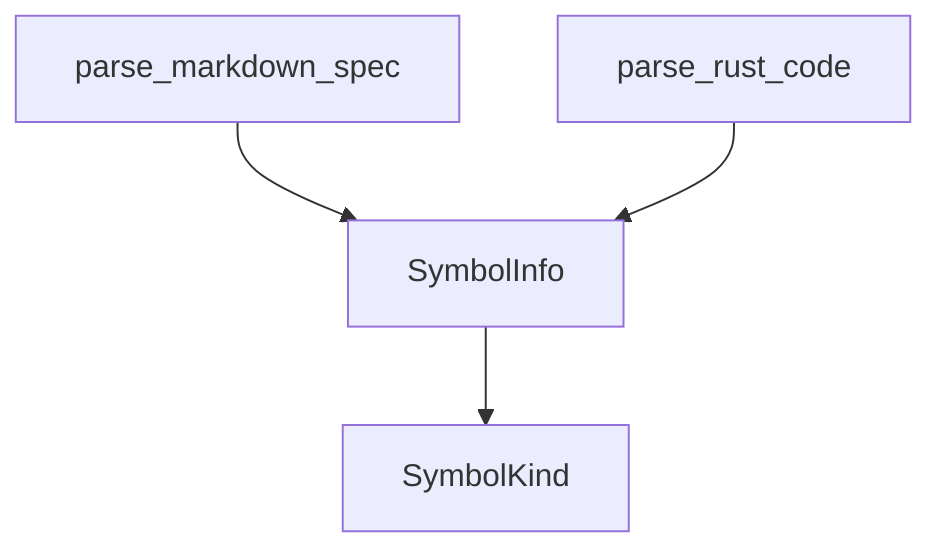

# docs/variables'n'functions/[Rust]parser.md

## 概要
Markdown仕様書およびRustソースコードから、変数や関数の宣言情報を抽出する構文解析モジュール。
仕様書のテキスト解析には `pulldown-cmark` を、Rustコードの構造解析には `tree-sitter` を使用する。

## データ構造定義

### `SymbolKind` (列挙型)
シンボルの種類。
- `Variable` - 変数
- `Function` - 関数

### `SymbolInfo` (構造体)
仕様書またはソースコードから抽出された宣言情報。
- **フィールド**:
  - `name: String` - 変数名または関数名。
  - `kind: SymbolKind` - シンボルの種類（変数か関数か）。
  - `params: Option<Vec<(String, String)>>` - 引数のリスト（名前と型）。関数の場合のみ有効。
  - `return_type: Option<String>` - 戻り値の型。関数の場合のみ有効。
  - `var_type: Option<String>` - 変数の型。変数の場合のみ有効。
  - `line_range: Option<(usize, usize)>` - 仕様書に記載されている、あるいはASTから検出した行範囲（開始行, 終了行）。

## 関数定義

### `parse_markdown_spec`
- **引数**:
  - `content: &str` - 仕様書Markdownのテキスト内容。
- **戻り値**: `Vec<SymbolInfo>`
- **説明**:
  - Markdownをパースし、変数・関数宣言のリストアイテム（例: `- fn login(user: String) -> Result (L10-20)`）を抽出する。
  - 正規表現や文字スキャンを用いて、シンボル名、引数、型、および行番号記述 `(L10-20)` をパースして `SymbolInfo` にマッピングする。

### `parse_rust_code`
- **引数**:
  - `code: &str` - Rustソースコードのテキスト内容。
- **戻り値**: `Vec<SymbolInfo>`
- **説明**:
  - tree-sitterパーサーを使用してRustコードをASTに変換する。
  - ASTを巡回（Walk）し、関数定義（`function_item`）、定数（`const_item`）、静的変数（`static_item`）、および構造体定義などのシンボル名・シグネチャを抽出する。
  - ASTノードのメタデータから、コード上の開始行および終了行（0-indexedから1-indexedに変換）を取得し、`SymbolInfo` を生成する。

## 依存関係マッピング (Dependency Mapping)

## 影響範囲 (Impact Scope)
- 新規追加ファイルのため、既存ファイルへの影響なし。
