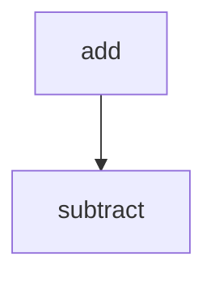

# docs/variables'n'functions/[Rust]sample.md

## 概要
手動検証用のサンプル仕様書。このファイルを保存した際に監査が実行される。

## 監査対象シンボル
- fn add(a: i32, b: i32) -> i32 (L1-4)
- fn subtract(a: i32, b: i32) -> i32 (L6-8)

## 依存関係マッピング (Dependency Mapping)

