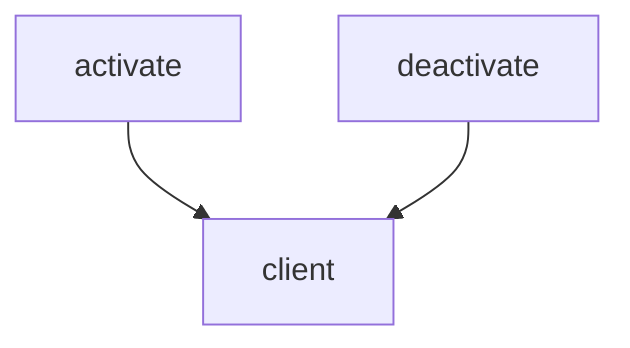

# docs/variables'n'functions/[TypeScript]extension.md

## 概要
VS Code拡張機能（TypeScript側）のエントリーポイント。
LSPサーバー（Rust）を起動し、VS Codeエディタとの間でLSP通信を媒介する軽量クライアントとして動作する。

## 変数定義

### `client`
- **型**: `LanguageClient | undefined`
- **説明**: 起動したLSPクライアントのインスタンスを保持するグローバル変数。

## 関数定義

### `activate`
- **引数**:
  - `context: vscode.ExtensionContext` - 拡張機能のコンテキストオブジェクト。
- **戻り値**: `void`
- **説明**:
  - 拡張機能がアクティブ化された際にVS Codeより呼び出される。
  - RustでビルドされたLSPサーバーバイナリのパス（通常は `server/target/release/server` またはデバッグバイナリ）を特定する。
  - サーバーの起動オプション（ServerOptions）およびクライアントオプション（LanguageClientOptions）を設定し、`LanguageClient` インスタンスを生成して起動する。
  - `docsAuditor.autoInjection` 設定変更の監視登録を行う。

### `deactivate`
- **引数**: なし
- **戻り値**: `Thenable<void> | undefined`
- **説明**:
  - 拡張機能がクローズまたは無効化される際に呼び出される。
  - `client` が起動していれば、クライアントの停止（`stop`）処理を呼び出す。

## 依存関係マッピング (Dependency Mapping)

## 影響範囲 (Impact Scope)
- 新規追加ファイルのため、既存ファイルへの影響なし。
