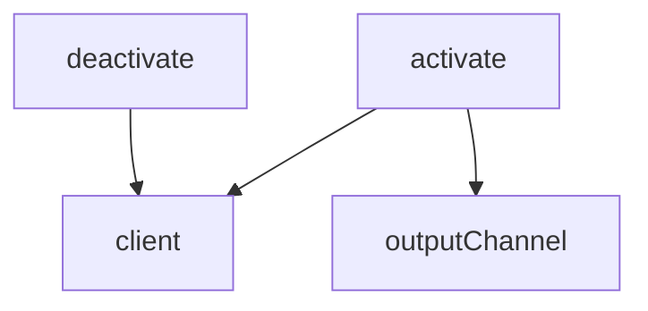

# docs/variables'n'functions/[TypeScript]extension.md

## 概要
VS Code拡張機能（TypeScript側）のエントリーポイント。
LSPサーバー（Rust）を起動し、VS Codeエディタとの間でLSP通信を媒介する軽量クライアントとして動作する。
サーバーの起動失敗時にホストがクラッシュするのを防ぐため、エラーハンドリングとログ収集用の出力チャネルを備える。

## 変数定義

### `client` (L11-11)
- **型**: `LanguageClient | undefined`
- **説明**: 起動したLSPクライアントのインスタンスを保持するグローバル変数。

### `outputChannel` (L12-12)
- **型**: `vscode.OutputChannel`
- **説明**: 拡張機能およびLSPサーバーのデバッグログを出力するためのVS Code出力チャネル。

## 関数定義

### `activate` (L28-125)
- **引数**:
  - `context: vscode.ExtensionContext` - 拡張機能のコンテキストオブジェクト。
- **戻り値**: `void`
- **説明**:
  - 拡張機能がアクティブ化された際にVS Codeより呼び出される。
  - `"Docs Auditor"` という名前の出力チャネルを作成する。
  - RustでビルドされたLSPサーバーバイナリのパスを特定する。
  - 開発の利便性を高めるため、ワークスペースフォルダ（`vscode.workspace.workspaceFolders`）が存在する場合は、ワークスペース配下の `server/target/debug/server.exe` または `server/target/release/server.exe` を優先してロードする。
  - ワークスペースが存在しない、またはバイナリが見つからない場合のみ、拡張機能インストール先内の `server/target/debug/server.exe` または `release/server.exe` を使用する。
  - サーバーの起動オプション（ServerOptions）およびクライアントオプション（LanguageClientOptions）を設定する。
  - `LanguageClientOptions` にて以下を設定：
    - `documentSelector` に Markdown、Rust、TypeScript、JavaScript、Python、Go、C、C++、C#、Ruby、Swift、Kotlin、Java を指定し、これらのファイルの変更を監視対象とする。
    - `outputChannel` に作成した出力チャネルを登録。
    - `initializationOptions` に `{ locale: vscode.env.language }` を指定し、エディタの表示言語設定をLSPサーバーに引き渡す。
    - `initializationFailedHandler` を設定し、LSPサーバーの起動や初期化が失敗した際にエラーを出力チャネルへ出力し、拡張機能ホストをクラッシュさせずに安全に終了（`false` を返却）させる。
  - `LanguageClient` インスタンスを生成して起動する。
  - `docsAuditor.autoInjection` 設定変更の監視登録を行う。
  
### `deactivate` (L127-133)
- **引数**: なし
- **戻り値**: `Thenable<void> | undefined`
- **説明**:
  - 拡張機能がクローズまたは無効化される際に呼び出される。
  - `client` が起動していれば、クライアントの停止（`stop`）処理を呼び出す。

## 依存関係マッピング (Dependency Mapping)

## 影響範囲 (Impact Scope)
- 起動時の安全性が向上し、LSPサーバー起動失敗時にも拡張機能開発ホストが巻き込まれてクラッシュするのを防止します。
- 開発時において、ワークスペース内の最新ビルド成果物を自動的に優先ロードするため、拡張機能の再インストールなしで最新の tree-sitter パーサーや監査ロジックを直ちにテスト可能になります。